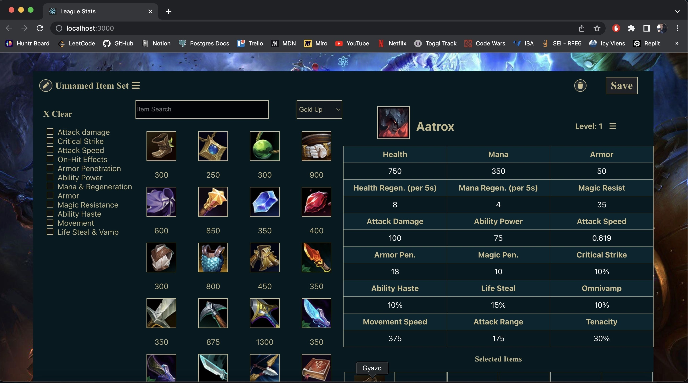

# League-Stats


## Table of Content

1. [General Info](https://github.com/MatchewXD/League-Stats/edit/main/README.md#general-info)
2. [Demo](https://github.com/MatchewXD/League-Stats/edit/main/README.md#%EF%B8%8F-demo)
    - [Stat Page](https://github.com/MatchewXD/League-Stats/edit/main/README.md#stat-page)
3. [Technologies](https://github.com/MatchewXD/League-Stats/edit/main/README.md#-technologies)
4. [Installation](https://github.com/MatchewXD/League-Stats/edit/main/README.md#-installation-and-setup)
5. [Contributors](https://github.com/MatchewXD/League-Stats/edit/main/README.md#-contributors)

## General Info
A website were the user can make a league of Legends champion build and see how the stats affect the champion. This website isn't finished yet. Here is the goal. The user will be able to make an account, save and share builds. With the stats page the user will be able to see a champions stats at any level with any item. The champions ability stats will adjust with their stat block as their level changes and items are added or removed. 

If everything goes well and I finish this project then some extra credit I want to accomplish is to make an average stat for every class. This will allow users to compare their current build with average build and maybe be able to find new, more effective, builds and be able to share them with the community.

Another piece of extra credit I want to accomplish is adding item passives and actives. One of the major factors in items is its passives or actives. With every build I want every passive and active to be displayed under the stat block so the user can compare not only stats but also passives and actives. This idea may be to much or unnecessary so I will consult some players to see if they think it would be useful to them. 

## 💠 Demo

### Stat Page
#### This is the main page of the website where everything happens. On this page the user can filter throught items, pick items and see all the stats from abilities, levels, and items combined. This page is specifically designed to look like League of Legends' item builder for user familiarity. 



---
## 🕹 Technologies

- Axios : 0.27.2
- Express : 4.18.0
- FontAwesome : 5.6.3
- Nodemon : 2.0.15
- pg : 8.7.3
- React : 17.0.2
- React-dom : 18.1.0
- React-fontawesome : 1.7.1
- Typescript : 4.6.4

## 🚀 Installation and Setup
```
$ git https://github.com/MatchewXD/League-Stats.git
```
From the root directory, run
```
$ npm install
$ npm run server
$ npm start
```
The database is on my personal computer so you won't get any of the images or stat data unless you download the datadragon file from league of legends ([Latest Verson](https://developer.riotgames.com/docs/lol#data-dragon)). First you will need Postgres installed then make a new database for storing the data. After that run:
```
$ node convertchamps.js
$ node convertitems.js
$ psql -d [your database name] -f schema.sql
```
I also manually added the champion and item images to the public folder in an image folder. This file is .gitignore'd. 
Restart the server and start the client👍

## 🤝 Contributors

- [Matthew Seagren](https://www.linkedin.com/in/matthew-seagren/)
